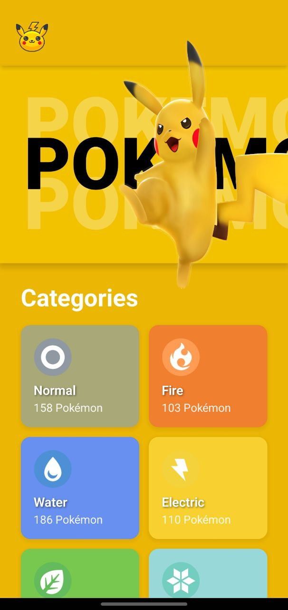
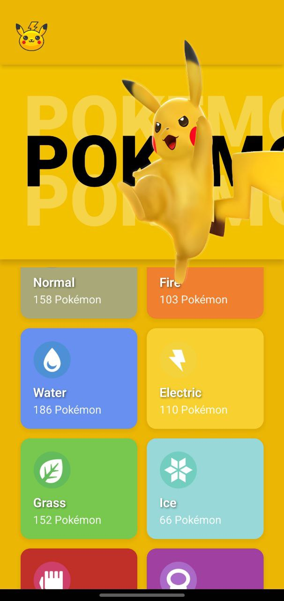
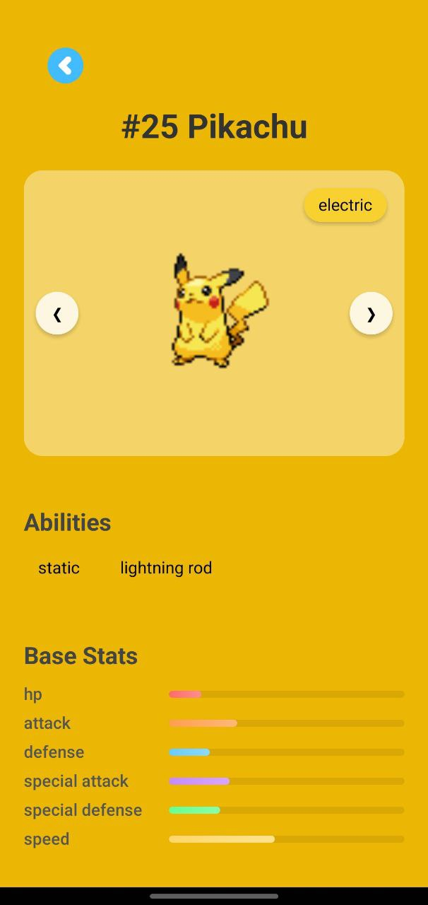
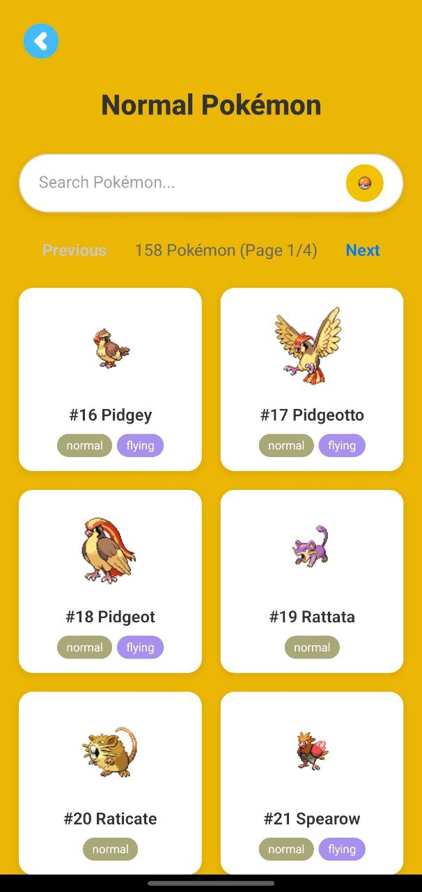
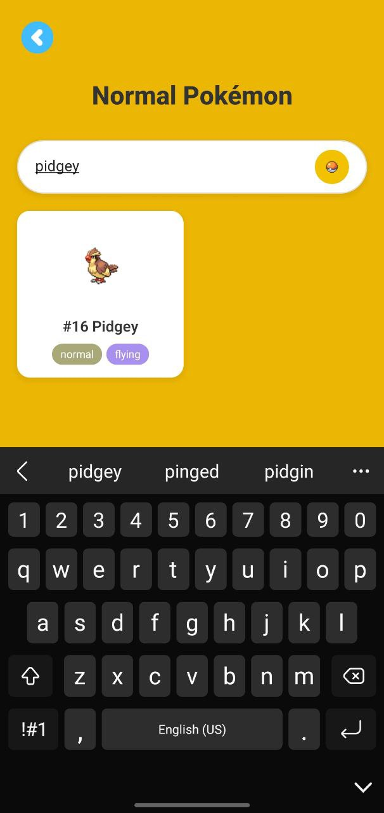
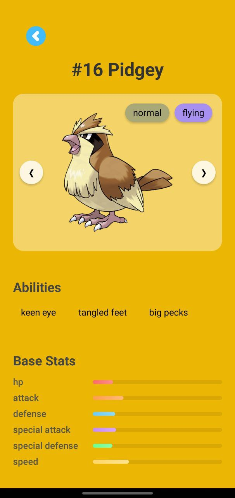

---

## 🧬 Pokémon Browser App (LynxJS + PokéAPI)

A futuristic mobile Pokémon browser built using [LynxJS](https://lynxjs.org), powered by the [PokéAPI](https://pokeapi.co/). Swipe through high-quality sprites, explore types, abilities, and animated stat bars — all in a sleek, modern UI.

---

### ⚡ Features

* 🔎 Browse and search Pokémon with live data from PokéAPI
* 🖼️ Swipeable image carousel of front/back and shiny sprites
* 🎯 Type chips with dynamic color coding
* 🧠 Ability chips for each Pokémon
* 📊 Animated, color-coded stat bars
* 💡 Smooth, futuristic UI design with responsive layout
* 🛠 Built for mobile with LynxJS — powered by ByteDance

---

### 📸 Screenshots

| Home                     | Pokémon Detail           | Stats                    |
| ------------------------ | ------------------------ | ------------------------ |
|  |  |  |
|  |  |  |
|  |  |                          |

---

### 🚀 Technologies

* **LynxJS** – Mobile UI framework by ByteDance
* **TypeScript** – Type-safe JavaScript
* **CSS** – Custom theming and animations
* **PokéAPI** – Free RESTful Pokémon data
* **GitHub** – Code management and collaboration

---

### 📦 Setup

```bash
# Install dependencies
npm install

# Run the app
npm run dev
```
### check the lynxjs documentation to setup the development env for android and ios
---

### 📝 License

This project is licensed under the [MIT License](LICENSE).

---
